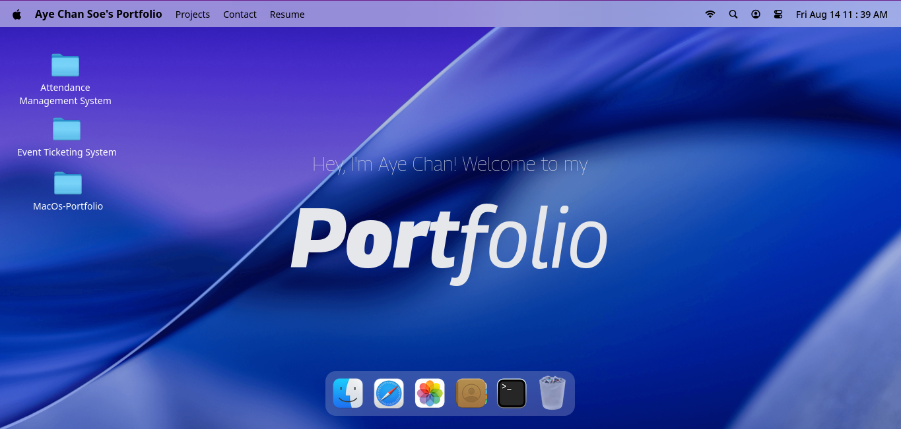

# MacOS-Style Portfolio

   

A macOS-inspired, interactive portfolio that presents projects, contact options, and a resume inside draggable desktop windows — built for rich, animated desktop/tablet presentations.

- Live Demo:
- Repository: <https://github.com/Aye-Chan-Soe/MacOs-Portfolio>
- Report a Bug: <ayechansoe.dev@gmail.com>

## Preview



_Primary view: a macOS-like desktop showing the Navbar, Welcome splash, Dock, and resizable/draggable app windows (Finder, Safari, Terminal, Resume, Gallery)._

## Key Features

- macOS-style window system: multiple draggable windows with z-index focus management (GSAP + Draggable).
- Centralized state: lightweight window and UI state using `zustand` with `immer` middleware.
- Rich animations: GSAP-driven micro-interactions (dock fisheye, text weight hover, entrance animations).
- Client-side contact flow: Email sending via `@emailjs/browser` and in-window forms.
- PDF resume rendering using `react-pdf` and file/folder mock filesystem in a Finder-like UI.

## Tech Stack

| Frontend     | State / Motion                    | Backend / API         | Database / ORM      | Package Manager |
| ------------ | --------------------------------- | --------------------- | ------------------- | --------------- |
| React 19.2.7 | Zustand (immer), GSAP (Draggable) | EmailJS (client-side) | N/A                 | pnpm            |

## Project Structure (high-level)

```text
.
├─ index.html
├─ package.json
├─ vite.config.js
├─ jsconfig.json
├─ src/
│ ├─ main.jsx
│ ├─ App.jsx
│ ├─ index.css
│ ├─ components/
│ │ ├─ Dock.jsx
│ │ ├─ Home.jsx
│ │ ├─ Navbar.jsx
│ │ ├─ Welcome.jsx
│ │ └─ WindowControls.jsx
│ ├─ constants/
│ │ └─ index.jsx
│ ├─ hoc/
│ │ └─ WindowWrapper.jsx
│ ├─ store/
│ │ ├─ window.js
│ │ └─ location.js
│ └─ windows/
│ ├─ Contact.jsx
│ ├─ Email.jsx
│ ├─ Finder.jsx
│ ├─ Gallery.jsx
│ ├─ Image.jsx
│ ├─ Resume.jsx
│ ├─ Safari.jsx
│ ├─ Terminal.jsx
│ └─ Text.jsx
├─ public/
│ ├─ files/ (static assets — images/icons omitted)
│ └─ ...
```

> Note: image files and icon folders are intentionally omitted from this tree for clarity.

## Screenshots

Small gallery of saved screenshots (placed in `public/assets/`):


- **Finder:** `public/assets/preview-finder.png` — Finder window showing projects.
- **Dock / Hero:** `public/assets/preview-dock.png` — Hero view with dock close-up.
- **Contact:** `public/assets/preview-contact.png` — Contact window with social links.
- **Resume:** `public/assets/preview-resume.png` — Resume pdf file.

## Getting Started (local)

All commands use `pnpm` as the package manager.

1. Clone the repository

```bash
git clone <repository-url>
cd MacOs-Portfolio
```

2. Install dependencies

```bash
pnpm install
```

3. Environment

```bash
cp .env.example .env
# then edit .env with real values
```

4. Run development server

```bash
pnpm dev
```

## .env (template)

Create a `.env` file and add the following keys (do not commit secrets):

```bash
VITE_EMAILJS_SERVICE_ID=
VITE_EMAILJS_TEMPLATE_ID=
VITE_EMAILJS_PUBLIC_KEY=
```

These keys are used by the client-side EmailJS integration in `src/windows/Email.jsx`.

## Contact & License

- Author: Aye Chan Soe
- Portfolio: <https://ayechansoe.dev>
- LinkedIn: <https://www.linkedin.com/in/aye-chan-soe/>
- GitHub: <https://github.com/Aye-Chan-Soe>

Licensed under the MIT License — see the LICENSE file for details.
